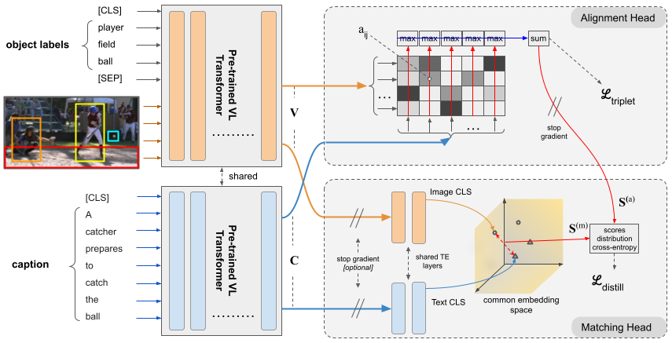

# ALADIN: Distilling Fine-grained Alignment Scores for Efficient Image-Text Matching and Retrieval

## Introduction
This is the code for reproducing the results from our paper *ALADIN: Distilling Fine-grained Alignment Scores for Efficient Image-Text Matching and Retrieval*, submitted to CBMI 2022.

Our code is based on OSCAR, whose repository is available [here](https://github.com/microsoft/Oscar). 

<p align="center">

</p>

## Installation
### Requirements
- Python 3.7
- Pytorch 1.2
- torchvision 0.4.0
- cuda 10.0

### Setup with Conda
```bash
# create a new environment
conda create --name oscar python=3.7
conda activate oscar

# install pytorch1.2
conda install pytorch==1.2.0 torchvision==0.4.0 cudatoolkit=10.0 -c pytorch

export INSTALL_DIR=$PWD

# install apex
cd $INSTALL_DIR
git clone https://github.com/NVIDIA/apex.git
cd apex
git checkout f3a960f80244cf9e80558ab30f7f7e8cbf03c0a0
python setup.py install --cuda_ext --cpp_ext

# install this repo
cd $INSTALL_DIR
git clone --recursive https://github.com/mesnico/OSCAR-TERAN-distillation
cd OSCAR-TERAN-distillation/coco_caption
./get_stanford_models.sh
cd ..
python setup.py build develop

# install requirements
pip install -r requirements.txt

unset INSTALL_DIR
```

### Download OSCAR & Vin-VL Retrieval data:
Download the checkpoint folder with [azcopy](https://docs.microsoft.com/it-it/azure/storage/common/storage-use-azcopy-v10):
```
path/to/azcopy copy 'https://biglmdiag.blob.core.windows.net/vinvl/model_ckpts/coco_ir/base/checkpoint-0132780/' <checkpoint-target-folder> --recursive
```

Download the IR data
```
path/to/azcopy copy 'https://biglmdiag.blob.core.windows.net/vinvl/datasets/coco_ir' <data-folder> --recursive
```

Download the pre-extracted Bottom-Up features 
```
path/to/azcopy copy 'https://biglmdiag.blob.core.windows.net/vinvl/image_features/coco_X152C4_frcnnbig2_exp168model_0060000model.roi_heads.nm_filter_2_model.roi_heads.score_thresh_0.2/model_0060000/' <features-folder> --recursive
```

## Training
``` 
cd alad 
python train.py --data_dir <data-folder>/coco_ir --img_feat_file <features-folder>/features.tsv --eval_model_dir <checkpoint-target-folder>/checkpoint-0132780 --config configs/<config>.yaml --logger_name <output-folder> --val_step 7000 --max_seq_length 50 --max_img_seq_length 34
```

### Configurations
The parameter `--config` is very important. Configurations are placed in yaml format inside the `configs` folder:
- `alad-alignment-triplet.yaml`: Trains the alignment head using hinge-based triplet ranking loss, finetuning also the Vin-VL backbone;
- `alad-matching-triplet-finetune.yaml`: Trains only the matching head using hinge-based triplet ranking loss. The parameter `--load-teacher-model` can be used to provide a backbone previously trained using the `alad-alignment-triplet.yaml` configuration;
- `alad-matching-distill-finetune.yaml`: Trains only the matching head by distilling the scores from the alignment head. The parameter `--load-teacher-model` in this case IS NEEDED to provide a correctly trained alignment head, previously trained using the `alad-alignment-triplet.yaml` configuration;
- `alad-matching-triplet-e2e.yaml`: Trains the matching head, finetuning also the Vin-VL backbone;
- `alad-alignment-and-matching-distill.yaml`: Trains the whole architecture (matching+alignment heads) end-to-end. The variable `activate_distillation_after` inside the configuration file controls how many epochs to wait before activating the distillation loss (wait that the backbone is minimally stable); alternatively, you can load a pre-trained backbone using the `--load-teacher-model` option.

### Monitor Training
Training and validation metrics, as well as model checkpoints are put inside the `<output-folder>` path.
You can live monitor all the metrics using tensorboard:
``` 
tensorboard --logdir <output-folder>
```

## Testing
The following script tests a model on the 1k MS-COCO test set (you can download our best model from [here](https://drive.google.com/drive/folders/112fBqzpeQPnb9hk-HJ8vjkNRicXq1-gX?usp=sharing); it is obtained with the `alad-alignment-and-matching-distill.yaml` configuration.)
```
cd alad
python test.py --data_dir <data-folder>/coco_ir --img_feat_file <features-folder>/features.tsv --eval_model_dir <checkpoint-target-folder>/checkpoint-0132780 --max_seq_length 50 --max_img_seq_length 34 --eval_img_keys_file test_img_keys_1k.tsv --load_checkpoint <path/to/checkpoint.pth.tar>
```
To test on 5k test set, simply set `--eval_img_keys_file test_img_keys.tsv`.

[//]: # (## Citation)

[//]: # (If you found our work useful for your research, please cite our paper:)

[//]: # ()
[//]: # (TODO)